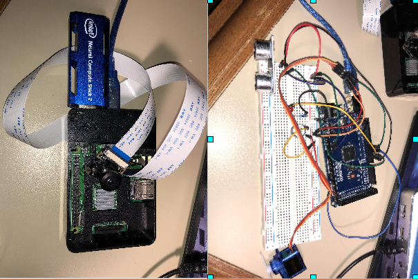

# Home Guard
Romote & Real time home security system using camera and sensors with raspberry Pi + Intel NCS2 + Arduino, sending and receiving information via AWS cloud.


## Material

Raspberry Pi 3B+, Intel NCS2, Arduino UNO, Fish-eyes CSL Camera, Ultrasonic sensor, Buzzer, Serv, Motion sensor, Temperature sensor.



## Requirements
```
pyhton 3.7
paho-mqtt
jpeg
OpenCV 4.0
pillow
qt
```

## Network Structure
We have been using above all parts for our system, solving issue for security for real time usage. We have installed a camera for capturing threat or anonymous things to identify clearly connecting to Raspberry Pi and Arduino via cloud connectivity and wi-fi. Camera will be working for three modes.1) Basic mode 2) Monitor mode 3) Face mode


Basic sensors information we use MQTT QoS2 to guarantee accuracy.

Camera pictures information we use MQTT QoS1 to guarantee real time receiving.

Virtual Device Statements are saved on AWS IOT device shadow.

## Data format
```
QoS 0 topic: ”topic/img”
Qos 1 topic: “@aws/things/Blackpi/update”
Qos 1 topic: “@aws/things/Blackpi/update/accepted”
2.3.2 Publish A message:
Raspberry Publish to “@aws/things/Blackpi/update”
 (qos: 1) message = {
	"timestamp": "2019-10-29T10:00:00",
	"temperature": “55",
	“motion": “1”
}
Desktop Application Publish to “@aws/things/Blackpi/update”
(qos: 1) message = {
	"timestamp": "2019-10-29T10:00:00",
	"system": "1",
	"camera": “0",
	“face": “1”
}
2.3.3 After Subscribe, Receive a message
 (qos: 1) message = {
	state: {
		"temperature": “55",
		“motion": “1”
	},
	matedata:{
		"temperature": {
			"timestamp": "2019-10-29T10:00:00"
		},
		“motion": {
			"timestamp": "2019-10-29T10:00:00"
		}
}
```

## Attention

The communication between Devices and AWS need provide a certificate
which rely on SSL Encrypted communication.

Client: CA-ROOT.crt, Private.key, Certificate.pem .crt

Server: Publish.key

This project remove these private documents. Please Create AWS IOT connect by yourself.

## RUN

Server and Client can start at any order. Please copy AWS-IOT-APP to PC, copy aws-iot to RaspberryPi, upload Project3_4 into Mega2560 board. connect RaspberryPi and Mega2560 with USB cable line.
```
To start the client
cd AWS-IOT-APP
python3 APP_UI.py
To start the Server
cd aws-iot
python3 arduino-mqtt
```
## APP_UI

There are 3 modes, Basic mode works at when Ultrasonic sensor activated in 30cm.
 Monitor mode works as ALL day monitor. Face Mode works at both Ultrasonic sensor activated and Face are recognized. You can trag angle bar to change the perspective of camera. Extention Applications have Motion Sensor which try to find animals, Temperature Sensor for Fire Prevention. Pedestrian mode to record passed people number.


## results

Basic Mode: led light means activating Ultrasonic in 30cm.


Monitor Mode: monitor work all the time, whatever Ultrasonic is activated or not.


Face Mode: After SSD find face/faces, information is uploaded to AWS then APP recieve the pictures. Face showing on APP as one picture.


